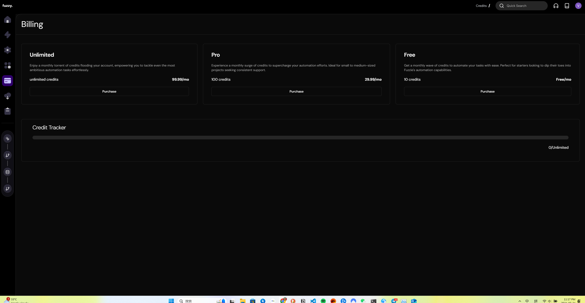
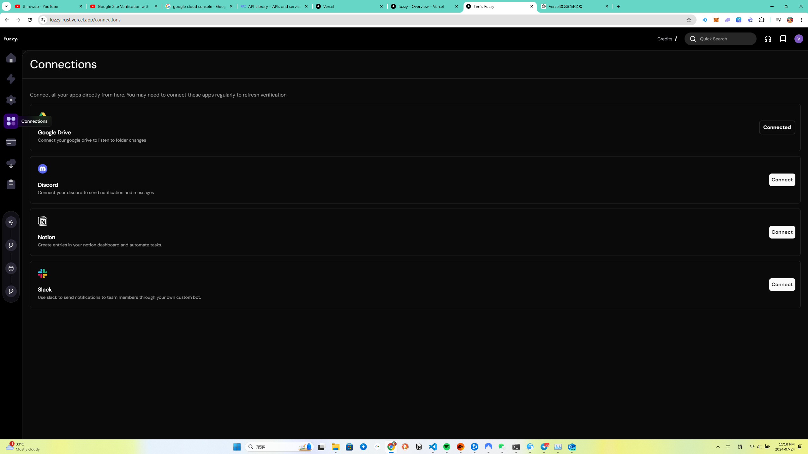
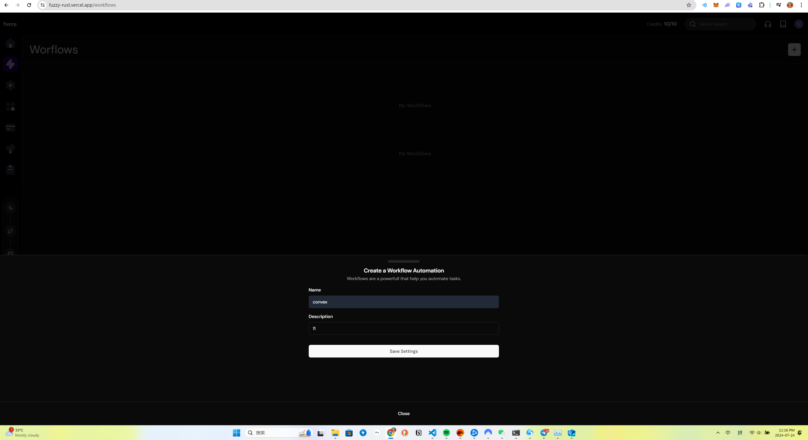
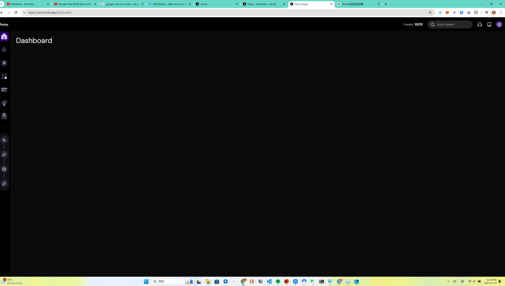
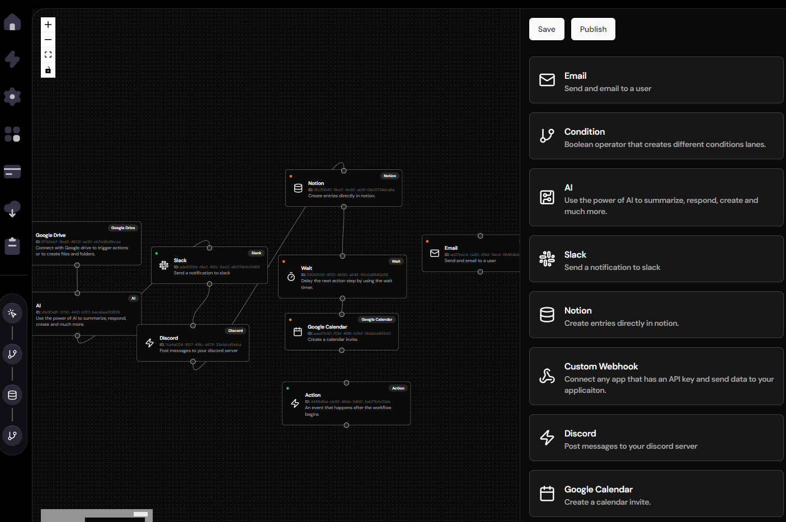

This is a [Next.js](https://nextjs.org/) project bootstrapped with [`create-next-app`](https://github.com/vercel/next.js/tree/canary/packages/create-next-app).
Welcome to the Fuzzy Project repository! This project is a comprehensive automation builder that integrates several technologies to create a seamless and powerful automation platform. Below, you'll find some key features and screenshots to give you an overview of what this project entails.

## Key Features

Authentication with Clerk: Secure and reliable user authentication.
Database with Neon Tech: Robust database management for efficient data handling.
File Uploads with Uploadcare: Easy and flexible file upload capabilities.
Development with Next.js : Leveraging the latest features of Next.js for a modern web application.
Payment Integration with Stripe: Manage subscriptions and payments effortlessly.
Node Interface and Workflow Builder: Create complex automation workflows with a drag-and-drop interface
Google Drive Integration: Connect and monitor changes in Google Drive.
Notifications with Slack and Discord: Send custom messages and notifications through Slack and Discord.
Data Management with Notion: Create and manage database entries in Notion.
Aceternity UI: Beautiful and functional UI components for a great user experience.
Light & Dark Mode: Switch between light and dark themes based on user preference
## Screenshots


### Billing Page


### Connect With Other


### Create Workflow


### Dashboard


### Main Page


### Workflow Demo

## Getting Started

First, run the development server:

```bash
npm run dev
# or
yarn dev
# or
pnpm dev
# or
bun dev
```

Open [http://localhost:3000](http://localhost:3000) with your browser to see the result.

You can start editing the page by modifying `app/page.tsx`. The page auto-updates as you edit the file.

This project uses [`next/font`](https://nextjs.org/docs/basic-features/font-optimization) to automatically optimize and load Inter, a custom Google Font.

## Learn More

To learn more about Next.js, take a look at the following resources:

- [Next.js Documentation](https://nextjs.org/docs) - learn about Next.js features and API.
- [Learn Next.js](https://nextjs.org/learn) - an interactive Next.js tutorial.

You can check out [the Next.js GitHub repository](https://github.com/vercel/next.js/) - your feedback and contributions are welcome!

## Deploy on Vercel

The easiest way to deploy your Next.js app is to use the [Vercel Platform](https://vercel.com/new?utm_medium=default-template&filter=next.js&utm_source=create-next-app&utm_campaign=create-next-app-readme) from the creators of Next.js.

Check out our [Next.js deployment documentation](https://nextjs.org/docs/deployment) for more details.
