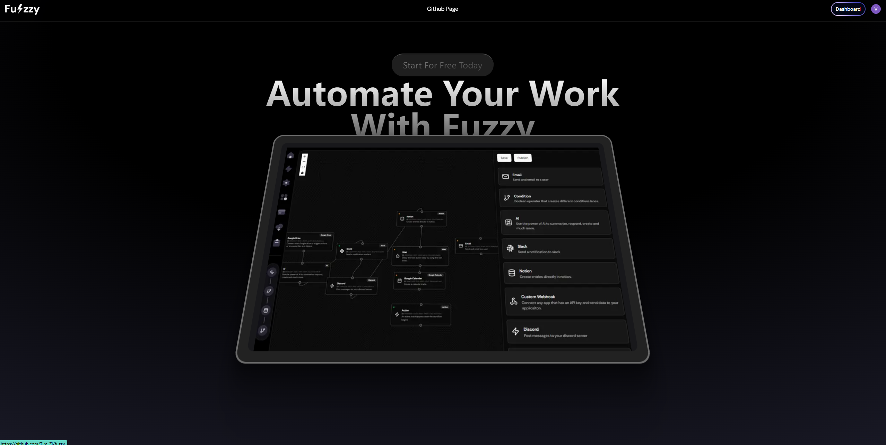

# Tim's Fuzzy Project


Welcome to the Fuzzy Project repository! This project is a comprehensive automation builder that integrates several technologies to create a seamless and powerful automation platform. Below, you'll find some key features and screenshots to give you an overview of what this project entails.

## Key Features

- **Authentication with Clerk**: Secure and reliable user authentication.
- **Database with Neon Tech**: Robust database management for efficient data handling.
- **File Uploads with Uploadcare**: Easy and flexible file upload capabilities.
- **Development with Next.js**: Leveraging the latest features of Next.js for a modern web application.
- **Payment Integration with Stripe**: Manage subscriptions and payments effortlessly.
- **Node Interface and Workflow Builder**: Create complex automation workflows with a drag-and-drop interface.
- **Google Drive Integration**: Connect and monitor changes in Google Drive.
- **Notifications with Slack and Discord**: Send custom messages and notifications through Slack and Discord.
- **Data Management with Notion**: Create and manage database entries in Notion.
- **Aceternity UI**: Beautiful and functional UI components for a great user experience.
- **Light & Dark Mode**: Switch between light and dark themes based on user preference.

## Screenshots

### Main Page

### Dashboard


### Create Workflow


### Workflow Demo

### Billing Page


### Connect With Other

## Getting Started

First, run the development server:

```bash
npm run dev
# or
yarn dev
# or
pnpm dev
# or
bun dev
